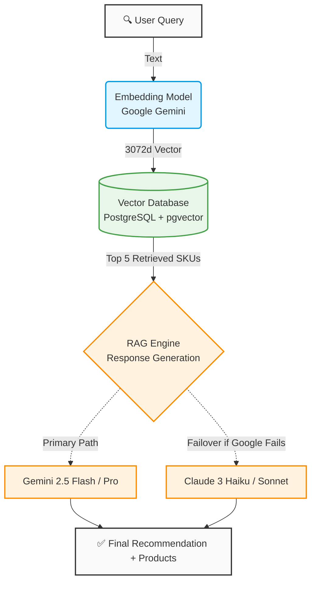

## System architecture

SKU Semantic Search is built on a modern stack that combines vector embeddings, semantic search, and the RAG (Retrieval-Augmented Generation) pattern to provide intelligent product recommendations.



## Request flow

When a user submits a search query, the system processes it through the following stages:

<Steps>
  <Step title="Request validation">
    FastAPI receives the search request and validates it using Pydantic schemas defined in `app/schemas/product_schema.py:22`:

    ```python
    class ProductSearchQuery(BaseModel):
        query: str
        limit: int = 5
    ```

    The request must include a text query and optionally a limit for the number of results.
  </Step>

  <Step title="Embedding generation">
    The user's query is converted into a 3072-dimensional vector using Google Gemini's embedding model (`app/services/llm_service.py:46`):

    ```python
    @staticmethod
    def get_embedding(text: str):
        try:
            result = genai.embed_content(
                model="models/gemini-embedding-001",
                content=text.replace("\n", " "),
                task_type="retrieval_query"
            )
            return result['embedding']
        except Exception as e:
            print(f"❌ Error generating embedding: {e}")
            raise e
    ```

    This vector is a mathematical representation of the semantic meaning of the query.
  </Step>

  <Step title="Vector similarity search">
    PostgreSQL with pgvector performs a cosine distance search to find the most similar products (`app/services/product_service.py:26`):

    ```python
    @staticmethod
    def search_products(db: Session, query: str, limit: int = 5):
        # 1. Get query embedding using Gemini
        query_embedding = LLMService.get_embedding(query)
        
        # 2. Search database using pgvector
        products = db.query(Product).order_by(
            Product.embedding.cosine_distance(query_embedding)
        ).limit(limit).all()
        
        return products
    ```

    The `cosine_distance` function efficiently finds products whose embeddings are closest to the query embedding in the 3072-dimensional space.
  </Step>

  <Step title="RAG-based generation">
    The retrieved products are formatted as context and passed to an LLM for natural language generation (`app/api/endpoints/products.py:14`):

    ```python
    @router.post("/search", response_model=SearchResultResponse)
    def search_products(search_data: ProductSearchQuery, db: Session = Depends(get_db)):
        # 1. Get similar products from vector search
        products_db = ProductService.search_products(db, search_data.query, limit=search_data.limit)
        
        # 2. Format context for LLM
        context = ". ".join([f"{p.name}: {p.description}" for p in products_db])
        
        # 3. Generate recommendation with multi-LLM failover
        ai_recommendation = LLMService.generate_answer(search_data.query, context)
        
        return {
            "query": search_data.query,
            "recommendation": ai_recommendation,
            "results": products_db
        }
    ```

    This ensures the AI only recommends products that actually exist in the database.
  </Step>

  <Step title="Response delivery">
    The API returns both the AI-generated recommendation and the structured product data:

    ```json
    {
      "query": "something to clean the floor",
      "recommendation": "[GOOGLE - models/gemini-2.5-flash] Based on your needs, I recommend...",
      "results": [
        {
          "id": 15,
          "name": "Desinfectante de Pisos",
          "description": "Líquido fragancia lavanda, elimina el 99% de bacterias.",
          "category": "Limpieza"
        }
      ]
    }
    ```
  </Step>
</Steps>

## Core components

### FastAPI application

The main application is defined in `app/main.py:14`:

```python
app = FastAPI(title=settings.PROJECT_NAME, version=settings.VERSION)

# CORS middleware for frontend integration
app.add_middleware(
    CORSMiddleware,
    allow_origins=["http://localhost:4200"],
    allow_credentials=True,
    allow_methods=["*"],
    allow_headers=["*"],
)

create_tables()

app.include_router(auth.router, prefix="/auth", tags=["Auth"])
app.include_router(products.router, prefix="/products", tags=["Products"])
```

### Database model

Products are stored with their embeddings in `app/models/product.py:5`:

```python
class Product(Base):
    __tablename__ = "products"

    id = Column(Integer, primary_key=True, index=True)
    name = Column(String, index=True, nullable=False)
    description = Column(Text, nullable=True)
    category = Column(String, index=True)
    
    # 3072-dimensional vector for Gemini embeddings
    embedding = Column(Vector(3072))
```

The `Vector(3072)` column type is provided by pgvector and enables efficient similarity searches.

### LLM service

The `LLMService` class (`app/services/llm_service.py:11`) manages AI provider interactions:

```python
class LLMService:
    # Hierarchical configuration for failover
    LLM_CONFIG = [
        {
            "provider": "google",
            "models": [
                'models/gemini-2.5-flash', 
                'models/gemini-flash-latest', 
                'models/gemini-2.5-pro'
            ]
        },
        {
            "provider": "anthropic",
            "models": ['claude-3-haiku-20240307', 'claude-3-5-sonnet-20240620']
        }
    ]
```

This configuration automatically tries multiple models in sequence until one succeeds.

## Key design decisions

<AccordionGroup>
  <Accordion title="Why pgvector instead of specialized vector databases?">
    pgvector provides several advantages for this use case:

    - **Simplicity:** Uses familiar PostgreSQL, no need to learn new database systems
    - **ACID compliance:** Full transactional support for product data
    - **Cost-effective:** No additional infrastructure or licensing costs
    - **Sufficient performance:** Handles thousands of products efficiently with proper indexing

    For production systems with millions of vectors, consider specialized solutions like Pinecone, Weaviate, or Qdrant.
  </Accordion>

  <Accordion title="Why Gemini for embeddings?">
    Google's Gemini embedding model offers:

    - **High dimensionality:** 3072 dimensions capture nuanced semantic relationships
    - **Multilingual support:** Works well with Spanish product descriptions
    - **Free tier:** Generous quota for development and testing
    - **Quality:** Strong performance on semantic similarity tasks

    The system could be adapted to use other embedding models like OpenAI's text-embedding-3-large with minimal changes.
  </Accordion>

  <Accordion title="Why RAG instead of fine-tuning?">
    The RAG pattern is preferred because:

    - **No training required:** Works immediately with new products
    - **Always up-to-date:** Reflects the current product catalog
    - **Prevents hallucinations:** AI can only recommend actual products
    - **Cost-effective:** No expensive fine-tuning jobs
    - **Transparent:** Easy to understand which products informed each recommendation

    RAG is ideal for dynamic catalogs that change frequently.
  </Accordion>

  <Accordion title="Why multi-LLM failover?">
    Provider resilience is critical because:

    - **API limits:** Free tiers have rate limits and quotas
    - **Downtime:** Even major providers have occasional outages
    - **Geographic restrictions:** Some providers may be unavailable in certain regions
    - **Cost optimization:** Can route to cheaper providers when primary is unavailable

    The failover system ensures high availability without manual intervention.
  </Accordion>
</AccordionGroup>

## Performance considerations

### Embedding cache

Product embeddings are generated once during creation and stored in the database. This avoids expensive re-computation on every search.

### Vector indexing

For optimal performance with large catalogs, create an index on the embedding column:

```sql
CREATE INDEX ON products USING ivfflat (embedding vector_cosine_ops)
WITH (lists = 100);
```

<Info>
  IVFFlat indexing trades a small amount of accuracy for much faster search times. For exact nearest neighbor search, use HNSW indexing instead.
</Info>

### Connection pooling

SQLAlchemy manages database connections efficiently via `app/db/session.py:9`:

```python
SessionLocal = sessionmaker(autocommit=False, autoflush=False, bind=engine)

def get_db():
    db = SessionLocal()
    try:
        yield db
    finally:
        db.close()
```

The `get_db` dependency ensures connections are properly released after each request.

## Next steps

<CardGroup cols={2}>
  <Card title="RAG pattern" icon="brain" href="/architecture/rag-pattern">
    Deep dive into Retrieval-Augmented Generation implementation
  </Card>
  <Card title="Multi-LLM failover" icon="shield-halved" href="/architecture/multi-llm-failover">
    Learn how automatic provider failover works
  </Card>
  <Card title="Database setup" icon="database" href="/guides/database-setup">
    Configure PostgreSQL and pgvector for optimal performance
  </Card>
  <Card title="Docker deployment" icon="docker" href="/guides/docker-deployment">
    Deploy the complete system with Docker Compose
  </Card>
</CardGroup>
